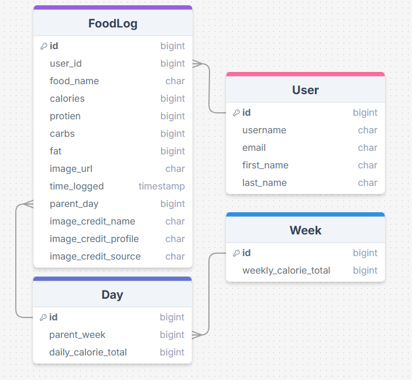

# 🍽️ FullSnack — Meal & Nutrition Tracker

**FullSnack** is a full-stack web app that helps users track their meals and understand the nutritional impact of what they eat. Built with Django and React, it integrates with the [CalorieNinjas API](https://calorieninjas.com/) for nutrition data and the [Unsplash API](https://unsplash.com/developers) for food images.

---

## 🚀 Features

- 🥗 **Search Meals** — View calorie, protein, fat, and carb data from CalorieNinjas
- 🖼️ **Visual Feedback** — Get food images from Unsplash API
- 📋 **Meal Log** — Save your meals with timestamps
- 📊 **Nutrition Overview** — Track daily nutrient totals
- 🔐 **User Auth** — Sign up, log in, and manage your own food history
- 💻 **Responsive UI** — Built with React + TailwindCSS

---

## 🧰 Tech Stack

### Backend (Django)
- Django 5
- Django REST Framework
- PostgreSQL
- Token Authentication (`rest_framework.authtoken`)
- CORS Headers (`django-cors-headers`)

### Frontend (React)
- React.js with Hooks
- Tailwind CSS
- React Router DOM
- Axios

### 3rd-Party APIs
- [CalorieNinjas API](https://calorieninjas.com/)
- [Unsplash API](https://unsplash.com/developers)

---

## 📂 Project Structure

```
/backend/      → Django API (models, views, serializers)
/frontend/     → React app (components, pages, styles)
/README.md
/.gitignore
```

---

## ⚙️ Setup Instructions

### Backend (Django)
```bash
cd backend
python -m venv .venv
source .venv/bin/activate
pip install -r requirements.txt
python manage.py migrate
python manage.py runserver
```

### Frontend (React)
```bash
cd frontend
npm install
npm start
```

> 🔑 Make sure to include your API keys for CalorieNinjas and Unsplash in `.env` files for both frontend and backend.

---

## 📸 Screenshots




---

## 🧑‍🎓 Author

**Alexander Douglas Walker**  
- 🌐 [LinkedIn](www.linkedin.com/in/alexander-walker-007160119)  
- 📧 alexwalker1337@gmail.com  
- 🛠️ U.S. Army Veteran | Cryptologic Linguist | Aspiring Full Stack Engineer  